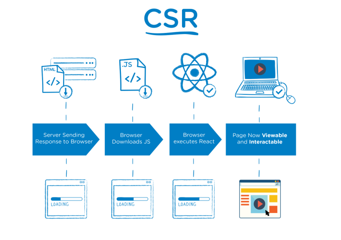
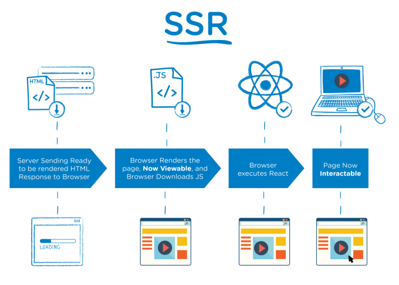

# Capítulo 17. Introducción a Server-Side Rendering


Tenemos todas las herramientas necesarias para desarrollar aplicaciones con VueJS. Hemos aprendido a crear componentes, a renderizarlos e interaccionar con ellos. Hemos aprendido a escalar nuestras aplicaciones mediante vue-router y vuex e incluso hemos aprendido a crear una build con Webpack para empaquetar nuestras aplicaciones.

Puede que todo esto sea suficiente para la mayoría de proyectos y puede que haya un número concreto de proyectos, en los que los tiempos de respuesta sean críticos para conseguir una masa suficiente de clientes, y que necesitemos nuevas herramientas para conseguir este plus de carga y eficiencia.

VueJS no abandona a estos desarrolladores y ha creado una librería que se basa en lo que llamamos "Renderizado en la parte servidor". A lo largo de los próximos capítulos estudiaremos este nuevo concepto que se está poniendo tan de moda en frameworks como Vue o React, aunque nos sean harto conocidos para los que hemos trabajado en proyectos con ASPX o JSP.

Veamos:

## ¿Qué es?

El Server-side rendering (o renderizado en la parte servidor) se basa en la posibilidad de poder renderizar el HTML de nuestros componentes en cadenas de texto en la parte servidor, vez de la parte cliente. Estas cadenas serán las respuestas que nuestros servidores de NodeJS devolverán a las peticiones principales de nuestra Web. En vez de funciones que manipulan DOM en el navegador, delegamos este renderizado a una fase anterior en el servidor.

Los siguientes diagramas explican perfectamente la diferentencia entre CSR (Client-side rendering) y SSR (Server-side rendering):





Es decir, en vez de que un usuario obtenga un `index.html` vacío en la primera petición de nuestra Web, como suele pasar en una SPA convencional, el sistema renderiza un primer esqueleto de la aplicación, para que el usuario tenga sensación inmediata de progreso. El contenido puede ser hidratado posteriormente si se desea.

Delegamos las primeras fases de renderizado a nuestro servidor en vez de a nuestro cliente. Esto tecnológicamente es muy potente porque consigue que componentes que se renderizaban en cliente, ahora también se rendericen en servidor. Hemos conseguido que nuestros componentes sean isomórficos o universales y nos permite evitar dos problemas típicos de las SPA.

## ¿Cuándo es útil?

Pensarás ¿para qué nos puede ser útil un mecanismo como este? Si bien hemos dicho siempre, una aplicación SPA ha tenido como misión permitir escalar mejor nuestros servidores ¿No es esto un regresar al pasado y volver a la época en que renderizábamos nuestras plantillas de PHP o Jade para NodeJS?

Pues podríamos decir que sí, con la diferencia de que ahora nuestra aplicación tiene la posibilidad de renderizarse donde nosotros decidamos. Tenemos que ser prácticos y serios y darnos cuenta de que existen una serie de proyectos donde las aplicaciones SPA no están cumpliendo su cometido. Por ejemplo:

### Posicionamiento Web

Necesitamos una aplicación que se encuentre posicionada en los buscadores más importantes del mercado, como Google o Bing, en las primeras posiciones. Los robots de estos buscadores se encuentran muy optimizados y empiezan a trabajar muy bien con aplicaciones que tienen un uso intensivo de JavaScript.

Ahora bien, trabajan muy bien con carga de JavaScript síncrono. Del asíncrono no quieren saber nada hasta el momento. Como nuestra aplicación empiece con un spinner de carga, nos vamos olvidando de que el buscador indexe algo más que tenga que ver con nuestra estructura de página o con nuestro contenido.

Es por esto que el renderizado en servidor es necesario. Necesitamos sistemas que permitan renderizar estos componentes en servidor para que cuando lleguen a los robots de Google o Bing, contenga un mayor número de matices en el HTML con el que nos puedan indexar.

### Prioridad al tiempo de carga frente al contenido

Los usuarios son muy impacientes. Y no vamos a negarlo, si estoy haciendo que un usuario se descargue una webapp entera y que se renderice, puede que lo hayamos perdido por el camino por tiempos excesivos de carga. La sensación de progreso y de que algo esté pasando es muy importante para mantener a nuestros usuarios.

Es por eso que si el propio servidor es capaz de agilizar estas primeras fases y de servir la estructura base, el usuario tendrá una sensación de carga menor. Renderizar e hidratar en servidor puede ayudarnos mucho a mantener a nuestros potenciales clientes.

## ¿Qué impacto en desarrollo me puede suponer usar SSR?

Tenemos que tener claro que hacer uso de SSR no va a ser útil para todos y que su uso tiene que estar muy justificado en nuestra aplicación, pues podemos tener 3 imprevistos con los que no habíamos contado:

1. Contar con SSR nos va a suponer tener un aumento en gastos por infraestructura. Nuestras aplicaciones SPA, cuando se encuentran empaquetadas, se comportan como estáticos que pueden ser servidos desde un CDN que tengamos contratado. Si necesitamos SSR, mínimo necesitamos una máquina que ejecute NodeJS para que se realice el sistema de renderizado en servidor.

2. Delegar este renderizado a servidor nos va a suponer una mayor carga en recursos. Lo que quizá provoque que nuestro sistema escale peor y que necesitemos más CPU o memoria en casos de un uso intensivo del sistema.

3. Algunas librerías de cliente que vayamos a usar, puede que no se lleven bien con el SSR y que tengamos que adaptarlas para que funcionen con este sistema. O incluso puede que ya tengamos una aplicación en vue servida como una SPA, que esté haciendo uso de hooks del ciclo de vida del componente, y que en SSR no vayan a funcionar por su propia naturaleza, teniendo que hacer adaptaciones.

## ¿Y si estos imprevistos me son insalvables a corto plazo?

Puede que estos imprevistos nos supongan un mayor esfuerzo de lo que podamos ganar con el propio SSR, por lo tanto tengámoslo en cuenta. La propia comunidad de vue pide cautela a la hora de usar estos sistemas y son partícipes de hacer uso, en primeras fases de desarrollo prerendering.

El prerendering es un proceso que se realiza en tiempo de construcción de la aplicación y que permite renderizar ciertos componentes que nosotros indiquemos. La idea subyace en usar Webpack para renderizar algunos componentes o vistas que nosotros veamos clave. Por ejemplo, sería buena opción renderizar las pantallas principales que serán las que más usuarios usen y las que mayor impacto puedan tener.

Para conseguir esto, haremos uso del plugin de Webpack [prerender-spa-plugin](https://github.com/chrisvfritz/prerender-spa-plugin). Con este plugin, podemos conseguir no hacer sobreingeniería, pero sí cumplir con ciertos requisitos de SEO y carga inmediata. Puede que en el futuro se nos quede algo corto, pero para primeras fases de un proyecto, nos puede bastar. Esto dependerá de nuestra experiencia y nuestro contexto.

## ¿Cómo puedo empezar?

Como siempre, lo primero que hacemos es instalar la librería que nos proporciona la comunidad de vue:

```
npm install vue vue-server-renderer --save
```

Esta librería está creada para NodeJS. Tendremos que tener en cuenta esto. Si necesitamos que el renderizado se produzca en servidores PHP, por ejemplo, tendremos que buscar otra alternativa para el renderizado.

El funcionamiento de la librería es fácil:

1. Se instancia la aplicación de vue que se quiere renderizar,
2. Se instancia la librería de renderizado,
3. Y se pasa la instancia de vue para que sea renderizada en formato cadena de HTML.

Veamos los pasos con código:

```javascript
// 1: Se crea la instancia de vue 
const Vue = require('vue'); 
const app = new Vue({ 
    template: '<div>Hello World</div>'
}); 

// 2. Se instancia la librería de SSR
const renderer = require('vue-server-renderer').createRenderer(); 

// 3. Se renderiza a cadena
renderer.renderToString(app, (err, html) => { 
    if (err) throw err; 
    console.log(html); 
});
```

Este ejemplo sirve para poco. Solo demuestra cómo funciona la librería. No deja de ser el típico funcionamiento de un motor de plantillas. Tu le ofreces una plantilla y el la renderiza en String HTML según las reglas de vue.

Lo importante ahora es ver cómo podemos satisfacer peticiones de los usuarios con SSR. Vamos a usar [express](http://expressjs.com/es/) como librería de infraestructura. Veamos el ejemplo:

```javascript
const Vue = require('vue'); 
const server = require('express')(); 
const renderer = require('vue-server-renderer').createRenderer(); 

server.get('*', (req, res) => { 
    const app = new Vue({ 
        data: { url: req.url }, 
        template: '<div>The visited URL is: {{ url }}</div>'
    });
 
    renderer.renderToString(app, (err, html) => { 
        if (err) { 
            res.status(500).end('Internal Server Error');
            return; 
        } 

        res.end(` 
            <!DOCTYPE html> 
            <html lang="en"> 
                <head>
                    <title>Hello</title>
                </head> 
                <body>${html}</body> 
            </html> 
        `); 
    }); 
});

server.listen(8080);
```

Nuestro ejemplo escucha peticiones en el puerto 8080. Cualquier petición que recibamos, ejecuta un manejador que se encarga de renderizar nuestra instancia de vue y enviarlo dentro de un `index.html` típico.

Bastante artesanal, pero no muy diferente de lo que queremos hacer en el mundo real.

Podemos mejorar el ejemplo anterior extrayendo el el HTML genérico a un template. Podemos guardar el siguiente HTML dentro de un fichero `index.template.html`:

```html
<!DOCTYPE html> 
<html lang="en"> 
    <head>
        <title>Hello</title>
    </head> 
    <body> 
        <!--vue-ssr-outlet-->
    </body> 
</html>
```

El comentario `<!--vue-ssr-outlet-->` es interpretado por la librería de rendering para inyectar el resultado final del renderizado. En nuestro código solo tendríamos que poner esto:

```javascript
const renderer = createRenderer({ 
    template: require('fs').readFileSync('./index.template.html', 'utf-8') 
}); 

renderer.renderToString(app, (err, html) => { 
    console.log(html)
});
```

De esta manera, la propia librería se encarga de hacer todo el trabajo. Queda mucho más limpio y nos da mayor flexibilidad que la plantilla base hardcodeada.

## Conclusión

Lo dejamos aquí por ahora. Hemos visto qué es esto del SSR y en que se diferencia con lo que hacen las SPAs convencionales. Hemos visto su utilidad y que inconvenientes tiene. Hemos estudiado que nos proporciona vue para cumplir con un SSR de calidad y por último hemos aprendido a cómo empezar un proyecto con SSR.

La librería tienen tal nivel de configuración que esto es solo la punta del iceberg de todo lo que podremos hacer. Como inicio está bien, pero aprender todo su potencial nos dará una mayor flexibilidad en el futuro.

Recordemos eso sí, que SSR no es apto para todo tipo de proyecto y que decidirnos por este modelo tendrá que ser una decisión muy bien meditada. Podríamos por ejemplo,  empezar a usar pre-rendering de vitas principales y quizá en el futuro hacer uso SSR.

Nos leemos :)